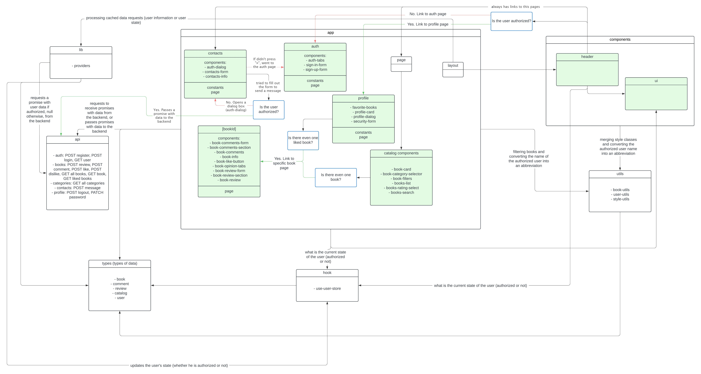
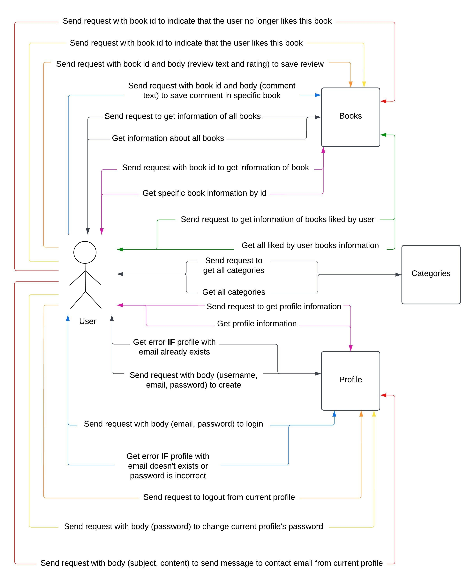

# Nodebook

## 📝 Опис проєкту

Цей проєкт — це книжковий форум, який дозволяє користувачам переглянути книги з їх описом та відгуками від інших користувачів, і можливість вподобати улюблені книги.

### 👨‍💻 Основні функції:

- **✍️ Реєстрація та авторизація**:

  - Реєстрація через логін і пароль (credentials).

- **📋🔍 Фільтрування та пошук книг**:

  - Користувачі можуть фільтрувати книги за жанрами.
  - Книги можна буде знайти за автором чи назвою у пошуковій системі.

- **👍❤️ Вподобання**:

  - Можливість поставити вподобання на улюблені книги.
  - Кожну вподобану книгу користувач може переглянути у своєму профілі.

- **💬 Коментарі щодо книг**:

  - Користувачі можуть залишити відгук (або коментар) щодо книги.
  - Користувачі зможуть переглянути опис книги та коментарі інших користувачів щодо неї.

## 💻 Технології

- **⌨️ Backend**:

  - Nest.js
  - MongoDB (база даних)
  - Jest

- **🖥 Frontend**:

  - Next.js
  - Tailwind CSS (для стилізації)
  - TypeScript
  - Jest
  - Playwright

- **🤖 Інтеграції**:

  - Nodemailer для надсилання повідомлень на пошту (а саме gmail).

## 📈 Діаграма компонентів

## 📈 Use Case діаграма

